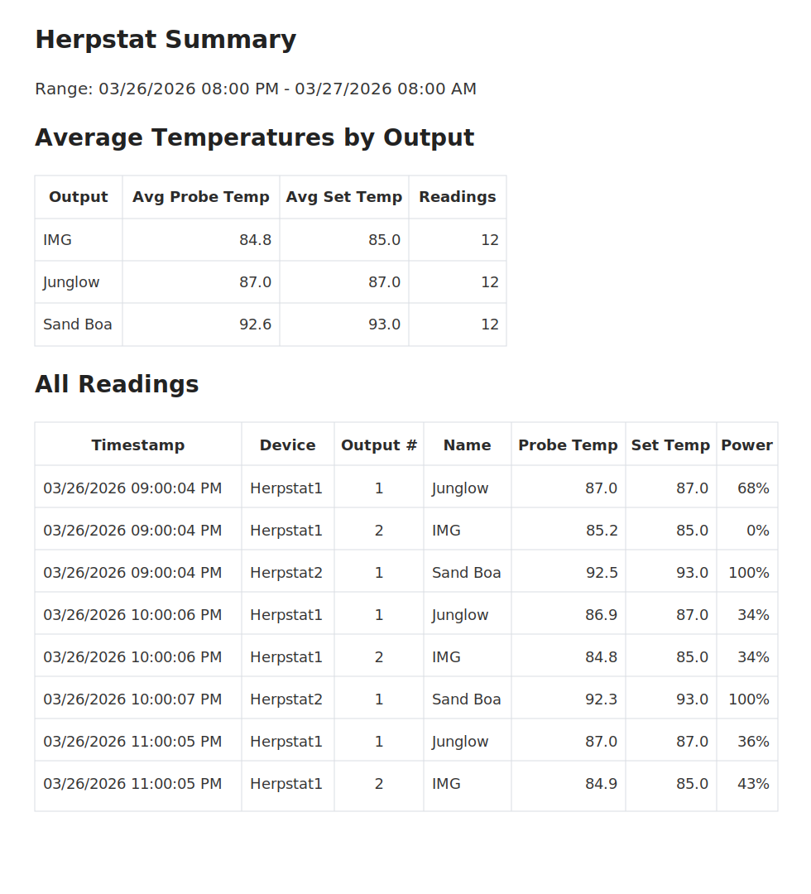

# Herpstat-Monitor

PowerShell monitor for Herpstat thermostats with CSV logging, Gmail SMTP email alerts, Textbelt SMS alerts, summary reporting, probe sanity checks, recovery notifications, and Healthchecks.io integration.

## What You Need

- Windows with PowerShell
- A supported Spyder Robotics Herpstat SpyderWeb device on your local network
- A Gmail account for email alerts
- A Gmail account with a Gmail app password for SMTP sending
- Optional: a Textbelt API key for SMS alerts
- Optional: a Healthchecks.io check for run monitoring

## Supported Devices

This script is intended for Spyder Robotics Herpstat models that include the SpyderWeb Wi-Fi/web interface.

Confirmed/documented models:

- Herpstat 1 SpyderWeb
- Herpstat 2 SpyderWeb
- Herpstat 4 SpyderWeb
- Herpstat 6 SpyderWeb

It relies on the local SpyderWeb web interface and the `RAWSTATUS` endpoint used by these Wi-Fi-enabled models. Older non-SpyderWeb models are not the target for this script.

Important:

- the device's `RAWSTATUS` page must be enabled for this script to work
- in the SpyderWeb manuals, that option appears under the advanced status integration settings

Manuals:

- Herpstat 1/2 SpyderWeb manual: https://www.spyderrobotics.com/manuals/Herpstat12_SpyderWeb_manual.pdf
- Herpstat 4/6 SpyderWeb manual: https://www.spyderrobotics.com/manuals/Herpstat46_SpyderWeb_manual.pdf

## Why Use This Script Instead of Only the Built-In Features?

Spyder Robotics already includes useful built-in SpyderWeb features, and for many users those may be enough.

Documented built-in features include:

- local web status viewing
- a history graph in the web interface
- scheduled email status updates
- emergency email alerts for conditions such as probe errors, high/low alarms, and device resets
- missed scheduled upload email alerts when the device fails to upload to the SpyderWeb site
- optional upload of status and charts to `herpstat.com` for online viewing
- advanced status integration options including a custom upload target and the `RAWSTATUS` page

This script is aimed at advanced users who want alerts that are harder to miss and reports that are easier to review without living in the web interface.

Common reasons to use it:

- get optional SMS text alerts for device issues, since email alerts are easy to miss
- keep getting reminder alerts while a device stays in a failure state, instead of relying on a single notice
- receive status and summary emails that are easy to open directly from your inbox
- review local CSV history and average-based summaries instead of only a point-in-time snapshot
- monitor multiple Herpstat devices in one workflow if you run more than one
- keep a local monitoring path that does not depend only on the SpyderWeb site upload path

In short:

- if the built-in SpyderWeb features already cover your needs, they are a good and free option from Spyder Robotics
- if you want text alerts, repeat reminders, and easier email-based review, this script is the advanced-user layer on top

## Example Report

Example of the summary email generated by the script:



## Quick Start

1. Open `HerpstatMonitor.ps1`.
2. Fill in the user configuration values near the top:
   - `Devices` and `DeviceNames`
   - `MailFrom` and `MailTo`
   - `SmtpUsername`
   - `SmtpAppPassword`
   - optional `SmsTo`, `TextbeltApiKey`, and `HealthchecksUrl`
3. Validate the configuration without sending alerts:

```powershell
.\HerpstatMonitor.ps1 -SendTestAlertsNow -DryRunAlerts
```

4. Validate live alert delivery:

```powershell
.\HerpstatMonitor.ps1 -SendTestAlertsNow
```

5. Set up Windows Task Scheduler for normal operation.

## Configuration Guide

This script is intentionally set up so most users can configure it by editing values near the top of `HerpstatMonitor.ps1`.

### Device Settings

Fill in these values first:

- `Devices`
  Add your Herpstat IP addresses or resolvable hostnames.
- `DeviceNames`
  Map each device entry to a friendly name like `Herpstat1` or `Rack Left`.
- `MailFrom`
  The Gmail address the script will send from.
- `MailTo`
  The email address that should receive alerts and summaries.

Example:

```powershell
[string[]]$Devices = @("192.168.1.50","192.168.1.51"),
[hashtable]$DeviceNames = @{
    '192.168.1.50' = 'Herpstat1'
    '192.168.1.51' = 'Herpstat2'
},
```

### IP Address vs Hostname

The script uses each `Devices` entry directly for:

- `Test-Connection`
- `http://<device>/RAWSTATUS`

That means a resolvable hostname can work, not just a numeric IP address.

In practice, static or reserved IPs are the recommended setup.

Both SpyderWeb manuals state that the Herpstat initially receives a dynamic IP from the router and that it is often better to reserve a fixed/static IP so the address does not change over time. That recommendation is especially helpful for this script because scheduled monitoring is more reliable when the device address stays the same.

If you do use a hostname instead of an IP:

- make sure Windows can resolve it reliably
- use that exact same hostname string as the key in `DeviceNames`

### Device Web Settings Required

Before using this script, make sure the SpyderWeb device is configured to expose the `RAWSTATUS` page.

The manuals describe this under the advanced status integration options. That section includes an option to enable the device's `/RAWSTATUS` page, which exposes JSON-style status data for custom applications.

If `RAWSTATUS` is not enabled, this script will not be able to read the device status correctly.

### Gmail SMTP Setup

The script now sends email through Gmail SMTP using an app password.

Fill in these values in `HerpstatMonitor.ps1`:

- `MailFrom`
- `MailTo`
- `SmtpUsername`
- `SmtpAppPassword`

Recommended setup:

1. Turn on 2-Step Verification for the Gmail account you want to send from.
2. Create a Gmail app password for `Mail` on a Windows computer or a custom app name.
3. Paste that app password into `SmtpAppPassword`.
4. Set `SmtpUsername` to the Gmail address that owns the app password.
5. Set `MailFrom` to that same address, or to a valid Gmail `Send mail as` alias on that account.
6. Set `MailTo` to the inbox that should receive alerts and summaries.

The defaults already target Gmail's SMTP server:

- `SmtpServer = "smtp.gmail.com"`
- `SmtpPort = 587`
- `UseSsl = $true`

Important notes:

- Gmail app passwords are not your normal Google account password.
- If `MailFrom` does not match the authenticated account or a valid Gmail alias, Gmail may reject the message.
- If you prefer a different SMTP provider, update `SmtpServer`, `SmtpPort`, `UseSsl`, `SmtpUsername`, and `SmtpAppPassword` accordingly.

### Textbelt SMS Setup

SMS is optional. If you leave `SmsTo` or `TextbeltApiKey` blank, SMS will stay disabled.

To set up Textbelt:

1. Create or buy an API key at Textbelt.
2. Put your destination phone number in `SmsTo`.
3. Put your API key in `TextbeltApiKey`.

Useful notes:

- In the U.S. and Canada, a normal 10-digit number usually works.
- Outside the U.S., E.164 format is the safest choice.
- Textbelt supports a free test key for limited use, and its docs also describe appending `_test` to your key to validate requests without consuming quota.

### Healthchecks.io Setup

Healthchecks is optional. If you leave `HealthchecksUrl` blank, Healthchecks pings are skipped.

To set it up:

1. Create a check in Healthchecks.io.
2. Copy the ping URL for that check.
3. Paste it into `HealthchecksUrl`.

This script sends:

- `/start` when the run begins
- base URL on success
- `/fail` when a device reaches the failure threshold

If you want to skip Healthchecks temporarily during testing, use:

```powershell
.\HerpstatMonitor.ps1 -SkipHealthchecks
```

### Initial Validation

1. Fill in the SMTP email values and destination email addresses.
2. Run:

```powershell
.\HerpstatMonitor.ps1 -SendTestAlertsNow -DryRunAlerts
```

3. Run:

```powershell
.\HerpstatMonitor.ps1 -SendTestAlertsNow
```

4. If you plan to use SMS, configure Textbelt and repeat the same test.
5. If you plan to use Healthchecks, add the ping URL and then switch to scheduled runs.

## Windows Task Scheduler Setup

This script is intended to run automatically on a schedule. The one-off commands in this README are mainly for setup, validation, and troubleshooting. For normal day-to-day operation, run it with Windows Task Scheduler.

### Choosing a Schedule

This script works with either lighter scheduled runs or more frequent polling.

Common patterns:

- `Every hour on the hour`
  Good for lighter monitoring when slower detection is acceptable.
- `Every 5 to 15 minutes`
  Better if you want faster alerts and more tolerance for schedule drift.

Tradeoffs:

- More frequent runs detect device failures, probe sanity issues, and recoveries sooner.
- More frequent runs also make it easier to hit summary windows even if the task does not fire at the exact minute.
- Hourly on-the-hour runs are completely valid, especially if your summary times are also on the hour.

If you run hourly on the hour:

- `SummaryWindowMinutes = 20` is usually fine for `8:00 AM` and `8:00 PM` summaries.
- `FailureThreshold = 2` means a device issue alert will normally happen after about 2 hours of consecutive failures.

If your task timing drifts or you want faster alerting, either widen `SummaryWindowMinutes` or run the task more frequently.

### Create the Task

1. Open `Task Scheduler`.
2. Click `Create Task`.
3. On the `General` tab:
   - give it a name like `Herpstat Monitor`
   - select `Run whether user is logged on or not` if you want it to keep working in the background
   - enable `Run with highest privileges` only if your environment needs it
4. On the `Triggers` tab:
   - create a new trigger
   - choose `Daily`
   - check `Repeat task every`
   - set it to your preferred interval such as `5 minutes`, `15 minutes`, or `1 hour`
   - set `for a duration of` to `Indefinitely`
5. On the `Actions` tab:
   - create a new action
   - `Program/script`:

```text
powershell.exe
```

   - `Add arguments`:

```text
-ExecutionPolicy Bypass -File "C:\Path\To\HerpstatMonitor.ps1"
```

   - `Start in`:

```text
C:\Path\To
```

6. On the `Conditions` tab:
   - disable `Start the task only if the computer is on AC power` if this is a laptop and you want it to run on battery
   - enable `Wake the computer to run this task` if needed
7. On the `Settings` tab:
   - enable `Allow task to be run on demand`
   - enable `Run task as soon as possible after a scheduled start is missed`
   - set `If the task is already running` to `Do not start a new instance`

### Example

If the script is stored in:

```text
C:\Users\YourName\Documents\Herpstat-Monitor\HerpstatMonitor.ps1
```

then use:

`Program/script`

```text
powershell.exe
```

`Add arguments`

```text
-ExecutionPolicy Bypass -File "C:\Users\YourName\Documents\Herpstat-Monitor\HerpstatMonitor.ps1"
```

`Start in`

```text
C:\Users\YourName\Documents\Herpstat-Monitor
```

### Scheduler Verification

After saving the task:

1. Right-click the task and choose `Run`.
2. Check the newest file in `Desktop\Herpstat\Verbose`.
3. Confirm it created or updated:
   - the verbose log
   - the CSV log
   - any test emails or alerts you expected

If you want to validate the scheduled task without sending live alerts first, temporarily use:

```text
-ExecutionPolicy Bypass -File "C:\Path\To\HerpstatMonitor.ps1" -DryRunAlerts -SkipHealthchecks
```

### Scheduler Tips

- Run the task on a machine that can actually reach your Herpstat IP addresses.
- If the computer sleeps often, consider wake settings or a device that stays on all the time.
- If you change the script path later, update the scheduled task action too.
- If Task Scheduler says the task ran but nothing happened, the verbose log in `Desktop\Herpstat\Verbose` is the first place to check.

## Validation and Troubleshooting Commands

Basic alert flow:

```powershell
.\HerpstatMonitor.ps1 -SendTestAlertsNow -DryRunAlerts
.\HerpstatMonitor.ps1 -SendTestAlertsNow
```

Summary deviation test:

```powershell
.\HerpstatMonitor.ps1 -SendTestSummaryDeviationNow -DryRunAlerts
```

Probe sanity test:

```powershell
.\HerpstatMonitor.ps1 -SendTestProbeSanityNow -DryRunAlerts
```

Reset saved alert states:

```powershell
.\HerpstatMonitor.ps1 -ResetAlertStates -DryRunAlerts
```

Optional one-off status or summary checks without device access:

```powershell
.\HerpstatMonitor.ps1 -ForceStatusNow -Devices @() -SkipHealthchecks
.\HerpstatMonitor.ps1 -ForceSummaryNow -Devices @() -SkipHealthchecks
```

## Troubleshooting

### Email / SMTP

Email sends fail

- Confirm `SmtpUsername` is the Gmail account that owns the app password.
- Confirm `SmtpAppPassword` is a current Gmail app password, not your normal Google password.
- Confirm `MailFrom` matches the authenticated Gmail account or a valid Gmail `Send mail as` alias.
- Confirm `smtp.gmail.com`, port `587`, and `UseSsl = $true` are still configured if you are using Gmail.
- Run:

```powershell
.\HerpstatMonitor.ps1 -SendTestAlertsNow
```

- Then check the newest log in `Desktop\Herpstat\Verbose`.

Authentication keeps failing

- Revoke and recreate the Gmail app password, then update `SmtpAppPassword`.
- Make sure the Google account still has 2-Step Verification enabled.
- If you switched to a non-Gmail SMTP provider, verify that provider's host, port, TLS, and login requirements.

### Textbelt SMS

SMS never sends

- Confirm both `SmsTo` and `TextbeltApiKey` are filled in.
- Check the verbose log for the Textbelt API response.
- If you are outside the U.S., try E.164 phone format.

SMS is being skipped

- The script uses per-category SMS cooldowns.
- A recent alert in the same category can suppress another SMS until the cooldown expires.
- Check the verbose log for `SMS suppressed by rate limit`.

SMS testing without consuming quota

- Textbelt documents a free test key and also supports appending `_test` to your key for test requests.
- That is useful when validating formatting before using live SMS credits.

### Device Connectivity

Devices are always unreachable

- Confirm the IPs in `Devices` are correct.
- Confirm the Windows machine running the script is on the same network and can reach the devices.
- Try pinging the Herpstat IP manually from the same machine.
- If the script is running on a different PC than usual, local firewall or routing may be different.

No outputs are found

- The device responded, but the script did not get usable output objects.
- Check the verbose log to see whether the RAWSTATUS request succeeded and whether output names were excluded.
- Confirm the device's `/RAWSTATUS` page is enabled in the SpyderWeb advanced status integration settings.
- Remember that names like `Nickname` or `Nickname2` are intentionally ignored by the script.

### Summary and Alert Timing

Summary email did not send

- The script only sends the scheduled summary inside the configured `SummaryWindowMinutes`.
- It also records the last sent target time so it does not resend the same scheduled summary repeatedly.
- If you run the script hourly, running it on the hour lines up best with on-the-hour summary targets.
- If your task timing drifts, widen `SummaryWindowMinutes` or run the task more frequently.
- Check:
  - `SummaryHourAM`
  - `SummaryHourPM`
  - `SummaryWindowMinutes`
  - `last_summary.json` in `Desktop\Herpstat`

Summary deviation or probe sanity alert did not repeat

- These alerts are stateful.
- Once an issue is active, the script avoids sending the same first-occurrence alert over and over.
- To retest first-occurrence behavior, use:

```powershell
.\HerpstatMonitor.ps1 -ResetAlertStates -DryRunAlerts
```

Recovery alert did not send SMS

- Recovery alerts are intentionally email-only.
- SMS is reserved for issue alerts.

### Task Scheduler

Task Scheduler says the task ran, but nothing happened

- Check the newest log in `Desktop\Herpstat\Verbose`.
- Confirm the scheduled task `Start in` folder is correct.
- Confirm the script path in `-File` is correct.
- Make sure the scheduled machine can still reach your Herpstat IPs.

The task works manually but not on schedule

- Make sure `Run whether user is logged on or not` is configured if needed.
- Check the `Conditions` tab for power or sleep restrictions.
- Confirm the task is repeating at your intended interval for `Indefinitely`.

### Fastest Debug Path

If something is not behaving the way you expect:

1. Run a dry-run validation command.
2. Run the matching live validation command if needed.
3. Open the newest file in `Desktop\Herpstat\Verbose`.
4. Check the JSON state files in `Desktop\Herpstat` if alert timing or repeat behavior seems wrong.

## Notes

- Runtime logs and state files default to `Desktop\Herpstat`, not the repo folder.
- The script is set up for top-of-file configuration so it is easier for non-technical users to edit.
- Normal operation is intended to be scheduled through Windows Task Scheduler.
- Before sharing your own configured copy, remove or rotate any real SMTP, SMS, or Healthchecks secrets.

## Helpful Links

- Gmail app passwords: https://support.google.com/accounts/answer/185833
- Gmail send-as aliases: https://support.google.com/mail/answer/22370
- Textbelt docs: https://docs.textbelt.com/
- Healthchecks.io HTTP pinging API: https://healthchecks.io/docs/http_api/
